# 🎓 Course Comparison Web App
Many students struggle to find the best courses and institutes in Pune. To simplify this, I built **Course Comparison** using **Django (Backend)** and **React (Frontend)**. It allows students to easily compare institutes based on fees, placement rates, and ratings — helping them find the best options within their budget.

---

## 🌐 Live Demo
🔗 [View Live Application][(https://course-comparison-frontend.onrender.com/compare)]
---
## 📸 Screenshots

### 🏠 Home Page

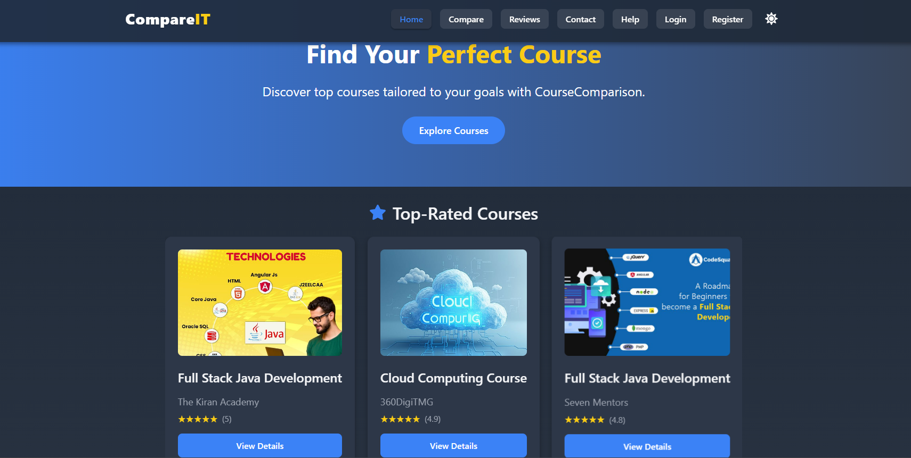
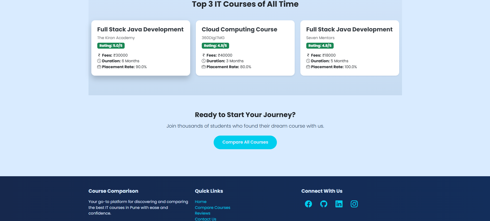
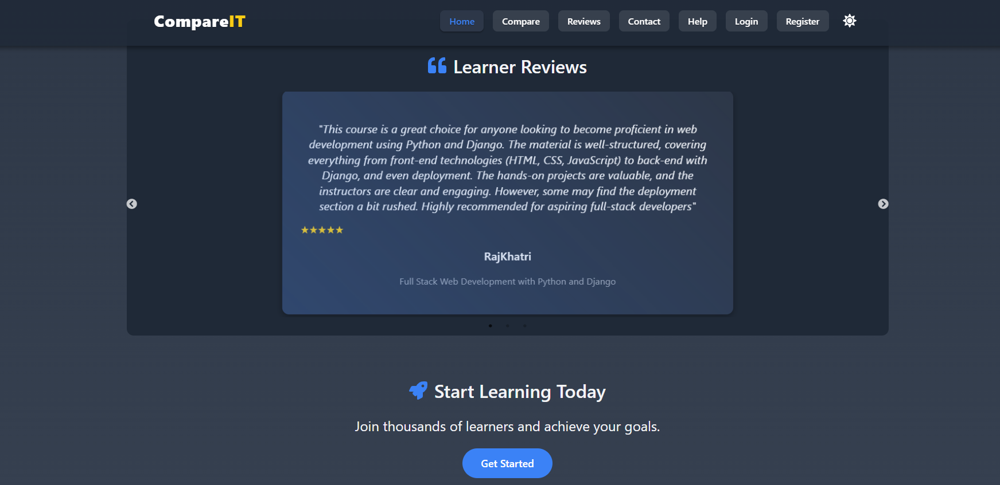


### 📊 Compare Courses

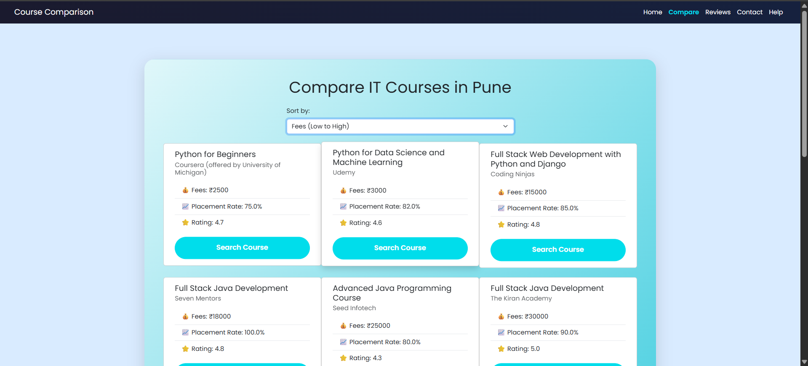

### 🗣️ Reviews

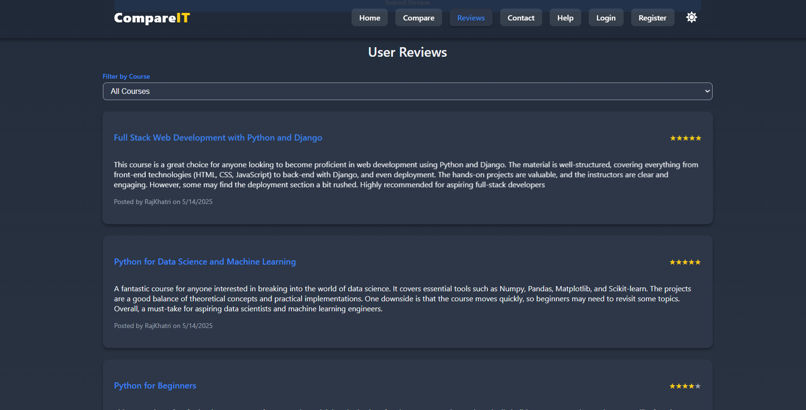

### 📝 Submit Review (Login Required)

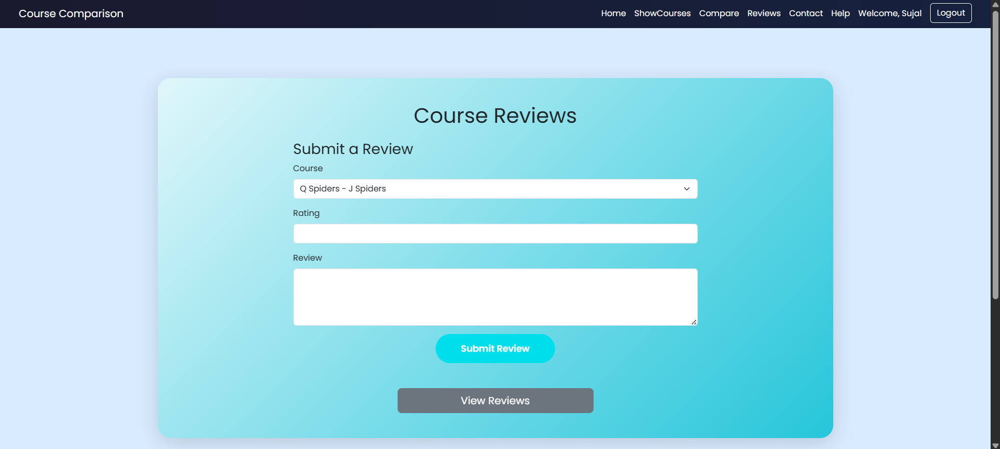

### ✉️ Contact Form

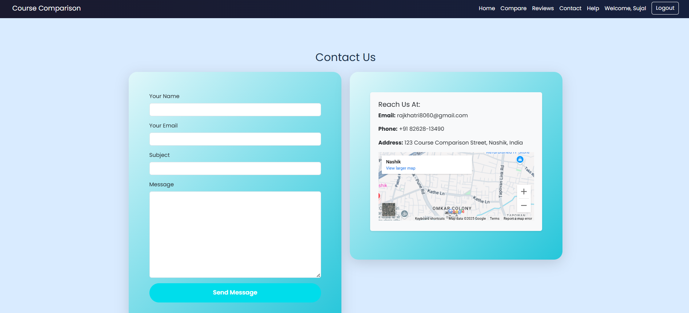

### ❓ Help / FAQ

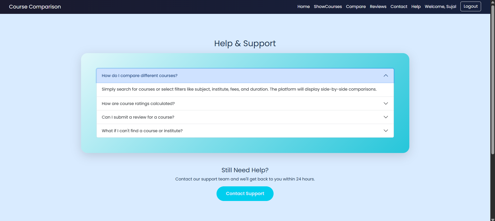

### 🔐 Login

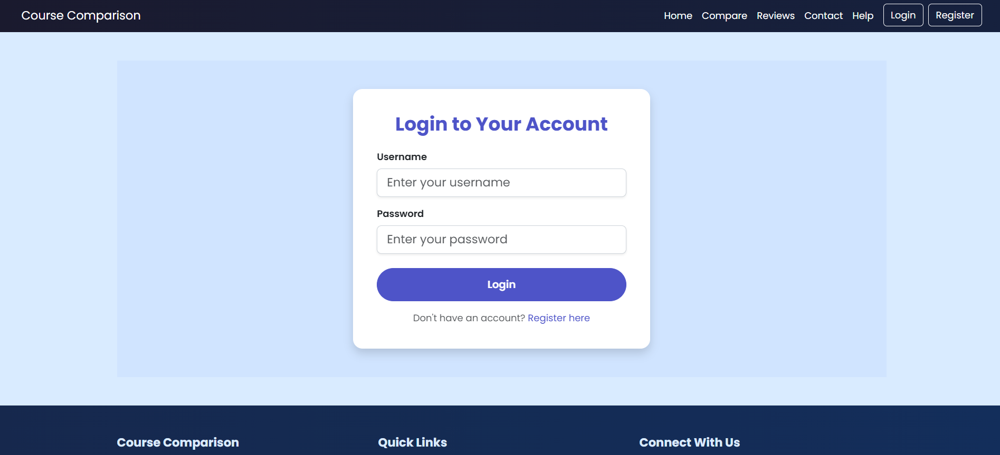

### 🧑‍💻 Register

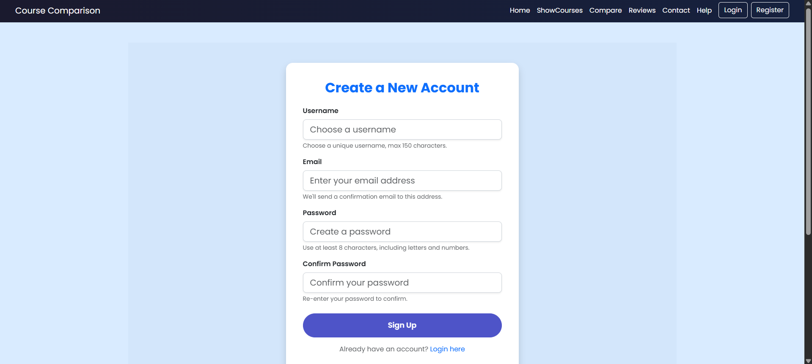

### 📊 Dashboard

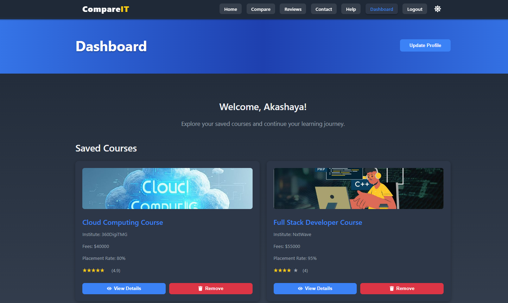

### 🧾 Course Detail Page

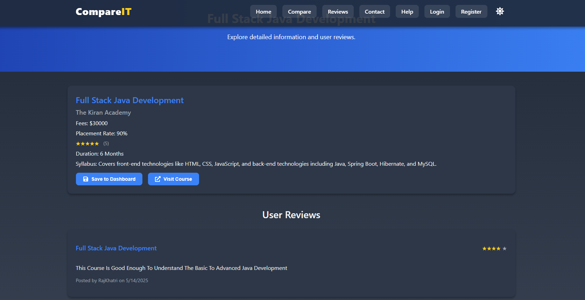

### 🧑 Update Profile

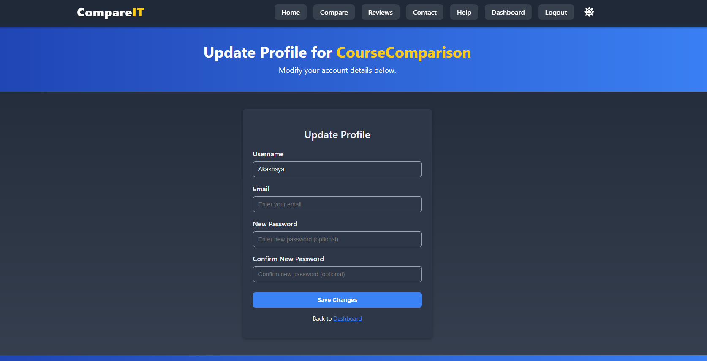


### ⚙️ Users Administration

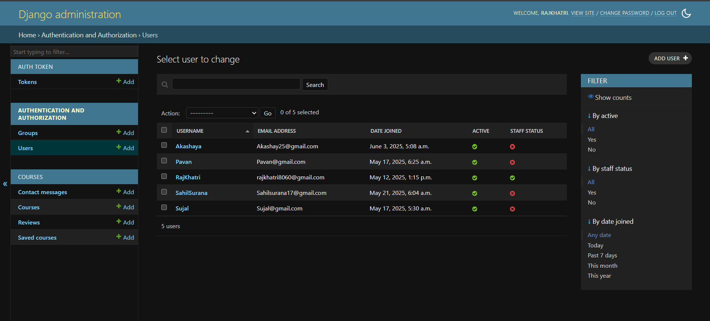

### ⚙️ Admin: Manage Courses

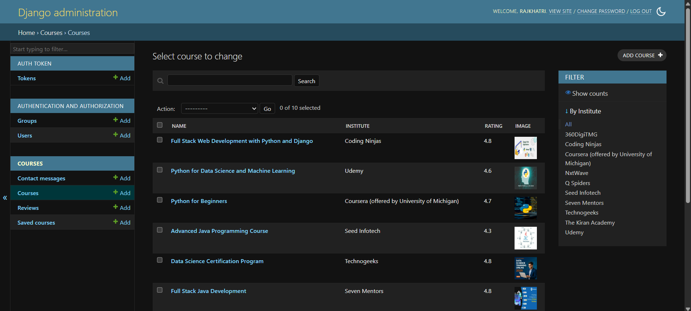

### ⚙️ Admin: Manage Reviews

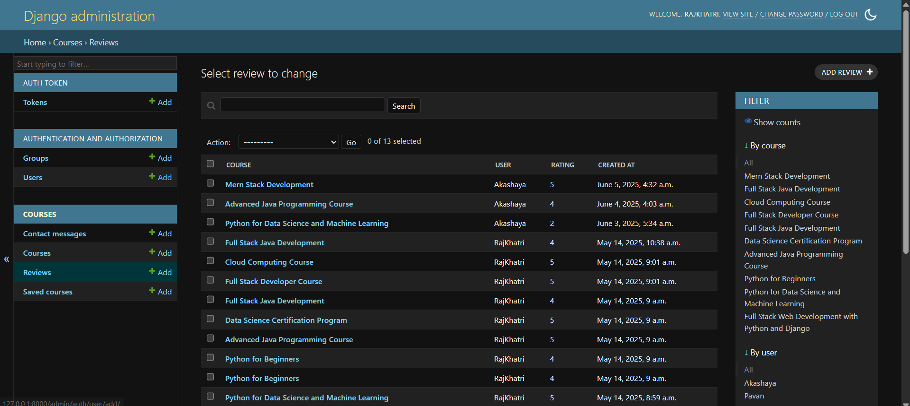

### ⚙️ Admin: Manage Enquiries

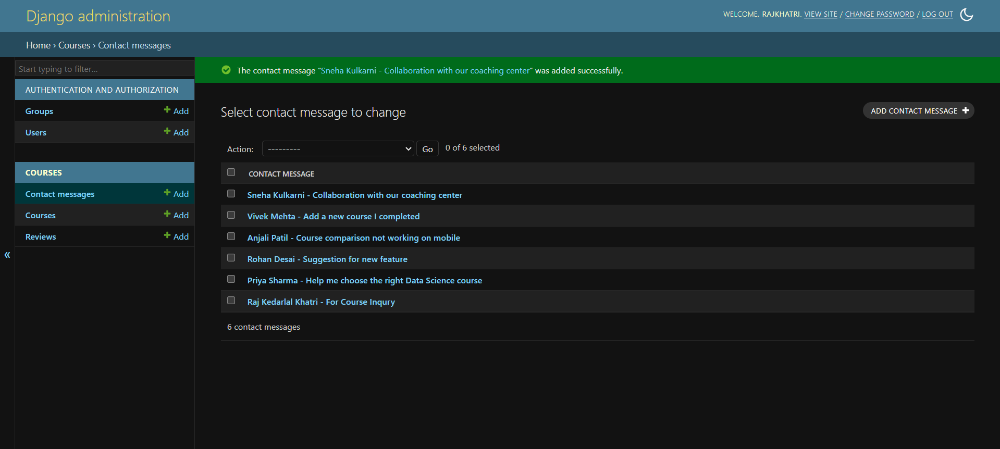

### ⚙️ Saved Courses

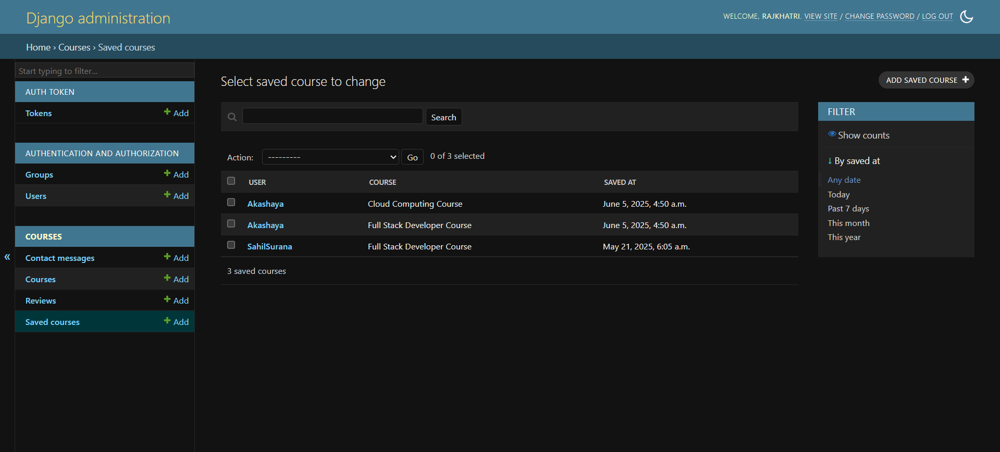

### 🔗 API: Courses

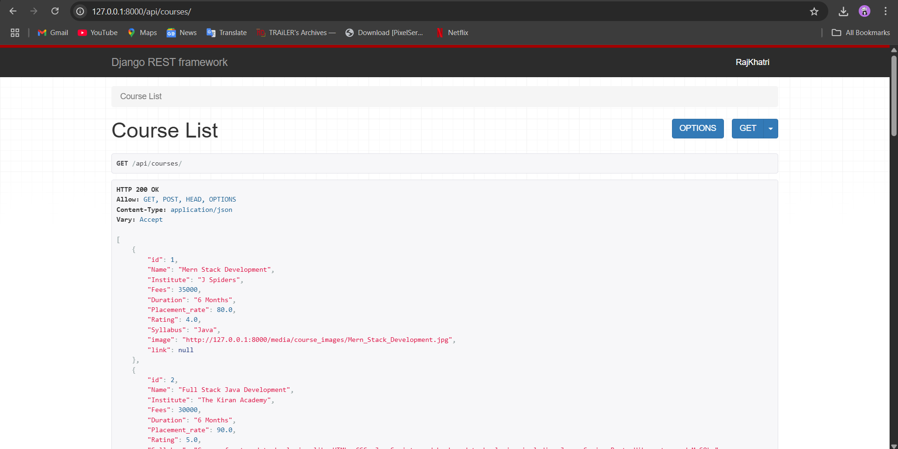

### 🔗 API: Reviews

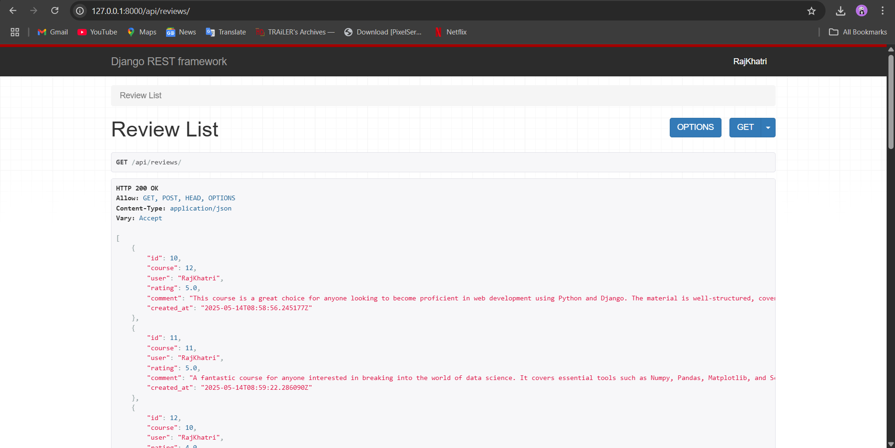

### 🔗 API: Contact Messages

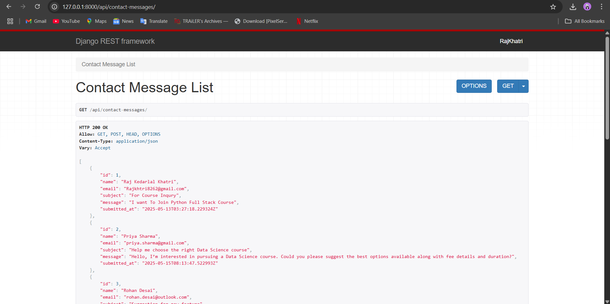
---

## 🔍 Features

* 🔎 **Search & Filter** – Easily search and filter courses by name, fees, and ratings.
* 📊 **Compare Courses** – Side-by-side comparison to find the best option.
* ⭐ **Ratings & Reviews** – View and share real user feedback.
* 📝 **Review System** – Authenticated users can submit reviews.
* ✉️ **Contact Admin** – Form to submit queries or messages.
* 🔐 **Authentication** – Secure login, logout, and registration.
* 🛡️ **Admin Panel** – Manage courses, reviews, and messages with full control.

---

## 🛠️ Tech Stack

* **Frontend:** React.js, Bootstrap, CSS3
* **Backend:** Django, Django REST Framework
* **Database:** MySQL
* **Others:** JWT Auth, React Hooks, Axios, Django Admin

---

## 📁 Project Structure

```
Course-Comparison/
├── backend/ (Django)
│   ├── comparison/
│   │   ├── models.py
│   │   ├── views.py
│   │   ├── serializers.py
│   │   ├── urls.py
│   │   ├── admin.py
│   │   └── ...
│   ├── CourseComparison/
│   └── manage.py
│
├── frontend/ (React)
│   ├── public/
│   ├── src/
│   │   ├── components/
│   │   ├── pages/
│   │   ├── services/
│   │   ├── App.jsx
│   │   └── ...
│   ├── package.json
│   └── ...
```

---

## 🚀 Getting Started

### 🔧 Prerequisites

* Python 3.8+
* Node.js & npm
* MySQL (or compatible DB)

---

## 🔨 Backend Setup (Django)

```bash
# 1. Navigate to backend
cd backend

# 2. Create and activate virtual environment
python -m venv venv
source venv/bin/activate      # Windows: venv\Scripts\activate

# 3. Install dependencies
pip install -r requirements.txt

# 4. Apply migrations
python manage.py makemigrations
python manage.py migrate

# 5. Create superuser for admin panel
python manage.py createsuperuser

# 6. Run the server
python manage.py runserver
```

> Backend API runs at: `http://127.0.0.1:8000/api/`
> Admin Panel: `http://127.0.0.1:8000/admin/`

---

## 💻 Frontend Setup (React)

```bash
# 1. Navigate to frontend folder
cd frontend

# 2. Install dependencies
npm install

# 3. Start the development server
npm start
```

> Frontend runs at: `http://localhost:3000`

> API base URL is set in `.env` or Axios instance for communication with Django backend.

---

## 🔗 Connecting Frontend and Backend

* Used **Axios** to make HTTP requests from React to Django REST API.

* Django CORS headers enabled in backend:

  ```python
  # settings.py
  INSTALLED_APPS += ['corsheaders']
  MIDDLEWARE.insert(0, 'corsheaders.middleware.CorsMiddleware')
  CORS_ALLOW_ALL_ORIGINS = True  # or specific origin list
  ```

* JWT Authentication implemented using `djangorestframework-simplejwt`.

---

## 📦 Sample requirements.txt (Backend)

```txt
Django>=4.0,<5.0
djangorestframework
djangorestframework-simplejwt
mysqlclient
corsheaders
pytz
sqlparse
asgiref
```

---

## 👨‍💻 Built With Love by Raj Khatri

* 📫 **Email**: [rajkhatri8060@gmail.com](mailto:rajkhatri8060@gmail.com)
* 💼 **GitHub**: [@khatri-raj](https://github.com/khatri-raj)

---

Let me know if you'd like a badge section (for tech, stars, forks), deployment info for platforms like **Render** or **Vercel**, or instructions for `.env` setup for both frontend and backend.
